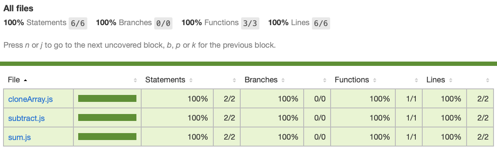

# **실습 내용**


1. 프로젝트의 branch 기본 구성은 master, feature branch로 구성한다.

2. README.md 파일의 documentation작업을 제외한 모든 작업은 feature branch를 새로 끊어서 작업을 시작한다.

<br/>

# Basic setting in project

3.  Jest 프레임워크를 활용한 테스트를 위해 간단한 JavaScript 파일들을 추가해준다.
    (Add simple javascript files to do unit test using Jest framework.)

4.  프로젝트에 새로운 npm package를 초기화 시켜준다.
    (Generate project folder without asking any questions.)

    ```bash
    $ npm init -y
    ```

5.  Jest를 developer dependency로 구분해서 설치해준다.

    ```bash
    $ npm i -D jest
    ```

6.  package.json의 test script를 "jest"로 해준다.

    ```bash
    "scripts": {
        "test": "jest"
    },
    ```

7.  기본적으로 Jest에서는 **test** 폴더 아래에 있는 테스트 파일들을 검사하기 때문에 테스트를 하기 위해 작성한 파일들은 **test** 폴더의 아래에 위치시키도록 한다.

    - 작성하는 테스트 파일의 이름은 테스트 하고자 하는 function이 위치한 파일명.test.js 와 같은 형태로 파일명을 지어주도록 한다.

<br/>

# **test code의 기본 작성법**

8. 작성한 test file에서는 테스트하고자 하는 function을 가진 파일을 import해서 해당 function를 테스트해야 한다.

   ```javascript
   const { test, expect } = require("@jest/globals");
   const sum = require("../sum");

   // 작성한 테스트코드가 무엇을 하는지에 대해서 첫번째 parameter로 작성해준다.
   test("properly adds two numbers", () => {
     // expected result
     expect(sum(1, 2)).toBe(3);
   });
   ```

   테스트하고자 하는 function은 위와 같이 `expect()`에 인자와 함께 넣어주고, 예상되는 값을 `toBe()`의 인자로 넣어서 검사를 하게 된다. toBe() 외에도 다양한 검사 조건이 있다.

9. Test 결과 확인

   ```bash
   > jest

   PASS  __test__/sum.test.js
   ✓ properly adds two numbers (2 ms)

   Test Suites: 1 passed, 1 total
   Tests:       1 passed, 1 total
   Snapshots:   0 total
   Time:        1.844 s
   Ran all test suites.
   ```

10. 구체적인 Test의 결과 확인
    package.json에서 test command script를 아래와 같이 수정을 해준다.
    다음의 --coverage 옵션을 넣어주면 각 test파일별로 구체적인 test의 정보를 확인할 수 있다.

    ```bash
    "scripts": {
        "test": "jest --coverage"
    }
    ```

    ```bash
    > jest --coverage
    PASS  __test__/cloneArray.test.js
    PASS  __test__/sum.test.js
    PASS  __test__/subtract.test.js
    ---------------|---------|----------|---------|---------|-------------------
    File           | % Stmts | % Branch | % Funcs | % Lines | Uncovered Line #s
    ---------------|---------|----------|---------|---------|-------------------
    All files      |     100 |      100 |     100 |     100 |
    cloneArray.js  |     100 |      100 |     100 |     100 |
    subtract.js    |     100 |      100 |     100 |     100 |
    sum.js         |     100 |      100 |     100 |     100 |
    ---------------|---------|----------|---------|---------|-------------------

    Test Suites: 3 passed, 3 total
    Tests:       3 passed, 3 total
    Snapshots:   0 total
    Time:        3.778 s
    ```

    자동생성된 coverage 폴더의 Icov-report 폴더 내부의 index.html 파일을 열어보면 아래와 같이 test 정보를 웹 페이지에서 확인할 수 있다.

    

<br/>

# **Jest Matcher**

이전에 사용했던 toBe() matcher는 숫자나 문자와 같은 기본 타입(Primitive Type)의 데이터를 비교할때 사용했다. 그럼 그 외에 다른 matcher에는 어떤 것들이 있는지 알아보고 실습을 해보도록 하겠다.

### **실습 해 볼 matcher**

- toEqual() : primitive type의 변수나 객체를 비교할때 사용된다.
  객체는 참조변수이기 때문에 값은 같더라도 참조하는 주소가 다르다.
- toStrictEqual() : 객체를 좀 더 엄격하게 검사할때 사용된다.

  ```javascript
  // makeUser()를 toEqual()로 검사를 하게 되면 passed
  // toStrictEqual()를 toEqual()로 검사를 하게 되면 failed
  const fn = {
    add: (a, b) => a + b,
    makeUser: (name, age) => ({ name, age, gender: undefined }),
    throwErr: () => {
      throw new Error("xx");
    }
  };
  ```

<br/>

- toBeNull() : Null이 되는 경우를 검사한다.

  ```javascript
  test("null은 null입니다.", () => {
    expect(null).toBeNull();
  });
  ```

- toBeUndefined()
- toBeDefined()

<br/>

- toBeTruthy()

  ```javascript
  // 빈 문자열이 아닌, helloworld 문자열을 반환하기 때문에 true를 반환한다.
  test("helloworld 문자열은 True입니다.", () => {
    expect(fn.add("hello", "world")).toBeTruthy();
  });
  ```

- toBeFalsy()

  ```javascript
  test("0은 false입니다.", () => {
    expect(fn.add(1, -1)).toBeFalsy();
  });
  // .not.toBeFalsy()
  test("helloworld 문자열은 False가 아닙니다.", () => {
    expect(fn.add("hello", "world")).not.toBeFalsy();
  });
  ```

<br/>

- toBeGreaterThan() : 초과
- toBeGreaterThanOrEqual() : 이상
- toBeLessThan() : 미만
- toBeLessThanOrEqual() : 이하

  ```javascript
  test("입력한 ID는 10자 이하여야 합니다.", () => {
    const id = "USER_ID";
    expect(id.length).toBeLessThanOrEqual(10);
  });
  ```

<br/>

- toBeCloseTo() <br/>
  JavaScript에서는 0.1 + 0.2가 0.3이 아니다. <br/>
  <b>Expected: 0.3</b> <br/>
  <b>Received: 0.30000000000000004</b><br/>
  컴퓨터는 이진법을 사용하기 때문에 몇 몇 연산은 무한소수로 표현되어 버린다. <br/>이러한 경우에 `toBeClose()`를 사용하면 된다.
  ```javascript
  test("0.1 더하기 0.2은 0.3이다.", () => {
    expect(fn.add(0.1, 0.2)).toBeCloseTo(0.3);
  });
  ```

<br/>

- toMatch() <br/>
  정규표현식과 toMatch()를 사용해서 정규식 검사를 할 수 있다.
  정규표현식의 대소문자 구분을 안하기 위해서는 정규표현식 뒤에 i 옵션을 붙여주면 된다.
  ```javascript
  test("Hello World 에 'a'라는 글자가 있는지 확인", () => {
    expect("Hello World").toMatch(/h/i);
  });
  ```

<br/>

- toContain() <br/>
  배열에서 특정 요소가 있는지 확인한다.
  ```javascript
  test("유저 리스트에 Mike 사용자가 있는지 확인", () => {
    const user = "Mike";
    const userList = ["Tom", "Mike", "Kai"];
    expect(userList).toContain(user);
  });
  ```

<br/>

- toThrow() <br/>
  함수실행시 예외가 발생하는 경우,
  toThrow()를 사용해서 에러가 발생하는지 확인할 수 있다.
  toThrow()의 인자로 발생한 에러를 비교할 수도 있다.
  ```javascript
  test("이거 에러 나나요?", () => {
    expect(() => fn.throwErr()).toThrow("xx");
  });
  ```
